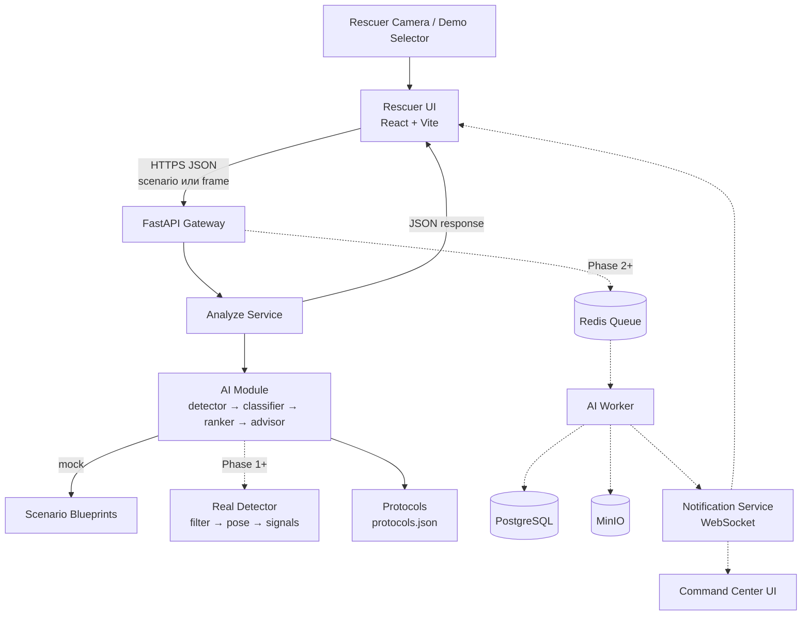

# Architecture

Документ описывает общую архитектуру **RescueVisionAI** — AI-ассистента спасателя. Цель — зафиксировать, как устроена система, как идут данные и где границы MVP.

---

## System goal

Помочь спасателю МЧС в полевых условиях:

- быстро понять, **сколько** пострадавших на сцене;
- определить, **кто в более тяжёлом состоянии** (приоритет спасения);
- получить **подсказку по первой помощи** в виде чеклиста;
- передать ситуацию в **штаб** в структурированном виде.

Ключевые качества системы:

- **Скорость** — ответ за секунды.
- **Надёжность формулировок** — никаких диагнозов, только подсказки.
- **Стабильный контракт API** — frontend не зависит от внутренностей AI.

---

## Actors

| Актор | Роль |
|---|---|
| Спасатель (Rescuer) | Отправляет кадр / запускает анализ, получает рекомендации |
| Штаб (Command Center) | Видит карту, статусы спасателей и пострадавших |
| Backend API | Принимает запросы, валидирует, координирует анализ |
| AI Service (mock на MVP) | Выполняет triage и формирует рекомендации |
| Data Layer | Хранит инциденты, кадры, результаты (вне MVP) |

---

## Components

### Клиентская сторона

- **Rescuer UI** — React + Vite + Tailwind, экран спасателя: выбор сценария, запуск анализа, отображение пострадавших и рекомендаций.
- **Command Center UI** *(вне MVP)* — веб-панель штаба с картой и статусами.

### Backend

- **API Gateway / FastAPI** — единая точка входа, CORS, Swagger, валидация Pydantic.
- **Analyze Service** — принимает запрос, дёргает AI через DI (`Analyzer`), возвращает структурированный ответ.
- **AI Module** — `detector` + `classifier` + `ranker` + `advisor`.
  - `detector`: на MVP — mock по `scenario`; на Phase 1+ — реальная инференция по `frame` (light filter → pose → aux-детекторы → signal extractor).
  - `classifier`, `ranker`, `advisor`: rule-based, не зависят от того, mock сейчас или real.
- **Protocols Service** — читает [`protocols.json`](../protocols.json) при старте (fail-fast если файл сломан).
- **Settings** — `pydantic-settings`, env-переменные с префиксом `RVA_`.

### Расширения (Phase 2+, за пределами текущего scope)

- **Message Broker** (Redis Streams / RabbitMQ) — очередь кадров для realtime-потока.
- **AI Worker** (отдельный процесс) — асинхронная обработка, разгрузка веб-процесса.
- **PostgreSQL** — инциденты, спасатели, история результатов.
- **MinIO / S3** — хранилище кадров для аудита и переобучения.
- **WebSocket Notification Service** — push спасателю и штабу.

---

## High-level diagram



Пунктиром — компоненты за пределами текущего этапа.

---

## Data flow

API принимает один из двух режимов: **mock** (по `scenario`) или **real** (по `frame`). Это два пути в одном эндпоинте; контракт ответа идентичен.

### Mock path (для demo и unit-тестов)

```
1. Rescuer UI
   POST /api/v1/analyze { incident_id, rescuer_id, scenario: "single_unconscious" }
   ▼
2. FastAPI Gateway
   валидация Pydantic; scenario должен быть из enum
   ▼
3. Analyze Service → AI Module (Analyzer через DI)
   ▼
4. detector.mock(scenario) → RawScene + list[RawVictim] из заранее заданных blueprints
   ▼
5. classifier → ranker → advisor (rule-based)
   ▼
6. JSON ответ по контракту
```

### Real path (Phase 1+)

```
1. Rescuer UI (телефон / браузер)
   снимает кадр с камеры (canvas → JPEG → base64)
   POST /api/v1/analyze { incident_id, rescuer_id, frame: "data:image/jpeg;base64,..." }
   ▼
2. FastAPI Gateway
   валидация Pydantic; должен быть либо frame, либо scenario
   ▼
3. Analyze Service → AI Module (Analyzer через DI)
   ▼
4. detector.real(frame):
       frame_decoder    → numpy.ndarray
       light_filter     → есть ли люди / не дубль / не битый
       pose_model       → bbox + keypoints для каждого
       aux_detectors    → кровь (OpenCV HSV), позже: ожоги/дым
       signal_extractor → keypoints + aux → signals ("lying", "no_movement", ...)
   → возвращает тот же RawScene + list[RawVictim], что и mock
   ▼
5. classifier → ranker → advisor (без изменений)
   ▼
6. JSON ответ по тому же контракту
```

Подробное описание реального pipeline и обоснование разделения "perception ↔ decision" — в [`docs/ai-triage-rules.md`](ai-triage-rules.md).

Полный формат ответа — в [`docs/api-contract.md`](api-contract.md).

---

## Alternative scenarios

### Высокая нагрузка

- Очередь растёт → горизонтально масштабируем воркеров.
- Приоритизация кадров со сценой `Critical`.
- Дедупликация дубликатов кадров от одного спасателя.

### Потеря связи со спасателем

- Нет кадров > 10 секунд → алерт в штаб.
- Последний известный статус остаётся активным.
- При восстановлении связи — продолжение работы.

### AI не нашёл пострадавших

- Возвращаем `victims: []` и сообщение «Пострадавшие не обнаружены».
- Кадр помечается `no_victims_detected` и сохраняется в аудит.

### Низкая уверенность модели

- `confidence < threshold` → `quality.low_confidence = true`.
- UI показывает предупреждение: «Оценка ненадёжна, требуется визуальный осмотр».
- В ответе обязательно присутствует `disclaimer`.

---

## Data model overview

На MVP БД не используется, но контракт сущностей зафиксирован для будущего расширения:

```sql
Incident      { id, name, location, started_at, status }
Rescuer       { id, incident_id, name, gps_lat, gps_lon, last_seen_at }
Frame         { id, rescuer_id, s3_url, timestamp, processing_status }
AnalysisResult {
  id, frame_id, victim_count,
  victims_json,     -- JSON массив пострадавших
  overall_risk,
  confidence,
  processed_at
}
Protocol      { id, title, steps_json, tags }
```

---

## Non-functional requirements

| Требование | Значение для MVP | Целевое для Phase 1+ |
|---|---|---|
| Время ответа `/analyze` | < 1 с (mock) | < 2 с (real, один кадр) |
| Частота кадров с фронта | по кнопке | 1 кадр в 1–2 секунды |
| Доступность API | best effort, локальный запуск | HEALTHCHECK + рестарт контейнера |
| Безопасность | CORS открыт для dev | CORS из env, без auth (учебный) |
| Логи | stdout FastAPI | то же |
| Воспроизводимость | детерминированный mock | mock-режим остаётся для тестов |

---

## Phase boundaries

### Phase 0 — MVP (DONE)

- FastAPI + 4 эндпоинта, контракт API зафиксирован.
- Rule-based AI на mock-сценариях.
- Тесты, ruff, pre-commit, CI, Docker, HEALTHCHECK.
- Без БД, без очередей, без real-инференции.

### Phase 1 — Real AI (next)

- Реальный `detector` по `frame`: light filter + pose model + signal extractor.
- Параллельно сохраняется mock-режим по `scenario`.
- Веб-страница (фронт) снимает кадры с камеры устройства и шлёт через `POST /analyze`.
- Без realtime-стриминга, без БД — один запрос ↔ один ответ.

### Phase 2+ — Production (out of scope учебного этапа)

- Realtime через WebSocket / RTSP / WebRTC.
- Очередь кадров (Redis Streams), AI Worker как отдельный процесс.
- PostgreSQL для инцидентов и истории, MinIO/S3 для кадров.
- Авторизация спасателей и штаба, multi-tenant.
- Multi-frame анализ (движение, тренды состояния).
