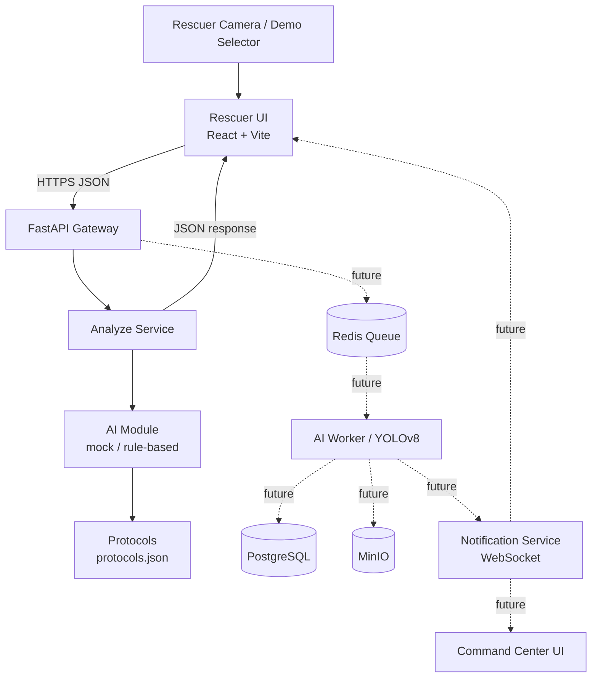

# Architecture

Документ описывает общую архитектуру **RescueVisionAI** — AI-ассистента спасателя. Цель — зафиксировать, как устроена система, как идут данные и где границы MVP.

---

## System goal

Помочь спасателю МЧС в полевых условиях:

- быстро понять, **сколько** пострадавших на сцене;
- определить, **кто в более тяжёлом состоянии** (приоритет спасения);
- получить **подсказку по первой помощи** в виде чеклиста;
- передать ситуацию в **штаб** в структурированном виде.

Ключевые качества системы:

- **Скорость** — ответ за секунды.
- **Надёжность формулировок** — никаких диагнозов, только подсказки.
- **Стабильный контракт API** — frontend не зависит от внутренностей AI.

---

## Actors

| Актор | Роль |
|---|---|
| Спасатель (Rescuer) | Отправляет кадр / запускает анализ, получает рекомендации |
| Штаб (Command Center) | Видит карту, статусы спасателей и пострадавших |
| Backend API | Принимает запросы, валидирует, координирует анализ |
| AI Service (mock на MVP) | Выполняет triage и формирует рекомендации |
| Data Layer | Хранит инциденты, кадры, результаты (вне MVP) |

---

## Components

### Клиентская сторона

- **Rescuer UI** — React + Vite + Tailwind, экран спасателя: выбор сценария, запуск анализа, отображение пострадавших и рекомендаций.
- **Command Center UI** *(вне MVP)* — веб-панель штаба с картой и статусами.

### Backend

- **API Gateway / FastAPI** — единая точка входа, CORS, Swagger, валидация.
- **Analyze Service** — оркестрирует обработку запроса `/analyze`.
- **AI Module** — `detector` + `classifier` + `ranker` + `advisor`. На MVP — mock по сценарию.
- **Protocols Service** — отдаёт протоколы из [`protocols.json`](../protocols.json).

### Расширения (вне MVP)

- **Message Broker** (Redis Streams / RabbitMQ) — очередь кадров.
- **AI Worker** (Celery) — асинхронная обработка.
- **PostgreSQL** — инциденты, спасатели, результаты.
- **MinIO** — хранилище кадров.
- **Notification Service** — WebSocket push спасателю и штабу.

---

## High-level diagram



Пунктиром обозначены компоненты **за пределами MVP**.

---

## Data flow (MVP happy path)

```
1. Rescuer UI
   │  Пользователь выбирает demo-сценарий и нажимает "Анализ"
   │
   │  POST /api/v1/analyze
   │  {
   │    "incident_id": "...",
   │    "rescuer_id": "...",
   │    "scenario": "single_unconscious",
   │    "gps": { "lat": ..., "lon": ... }
   │  }
   ▼
2. FastAPI Gateway
   │  → CORS, валидация Pydantic
   │  → Передача в Analyze Service
   ▼
3. Analyze Service
   │  → Вызывает AI Module по сценарию
   ▼
4. AI Module (mock)
   │  → Возвращает scene, victims, severity, recommendations
   ▼
5. Analyze Service
   │  → Подмешивает протоколы из protocols.json
   │  → Формирует overall_risk, confidence, quality, disclaimer
   ▼
6. FastAPI → Rescuer UI
   200 OK + структурированный JSON
   ▼
7. Rescuer UI
   → Показывает карточки пострадавших, чеклист действий, протоколы
```

Полный формат ответа — в [`docs/api-contract.md`](api-contract.md).

---

## Data flow (расширенная версия, вне MVP)

```
Camera ──► Mobile App ──► API Gateway ──► Ingestion Service
                                              │
                                              ▼
                                       Message Broker (Redis)
                                              │
                                              ▼
                                  AI Worker (Celery + YOLOv8)
                                              │
                              ┌───────────────┼───────────────┐
                              ▼               ▼               ▼
                         PostgreSQL        MinIO        Notification Service
                                                              │
                                                              ▼
                                                      Rescuer UI / HQ UI
```

---

## Alternative scenarios

### Высокая нагрузка

- Очередь растёт → горизонтально масштабируем воркеров.
- Приоритизация кадров со сценой `Critical`.
- Дедупликация дубликатов кадров от одного спасателя.

### Потеря связи со спасателем

- Нет кадров > 10 секунд → алерт в штаб.
- Последний известный статус остаётся активным.
- При восстановлении связи — продолжение работы.

### AI не нашёл пострадавших

- Возвращаем `victims: []` и сообщение «Пострадавшие не обнаружены».
- Кадр помечается `no_victims_detected` и сохраняется в аудит.

### Низкая уверенность модели

- `confidence < threshold` → `quality.low_confidence = true`.
- UI показывает предупреждение: «Оценка ненадёжна, требуется визуальный осмотр».
- В ответе обязательно присутствует `disclaimer`.

---

## Data model overview

На MVP БД не используется, но контракт сущностей зафиксирован для будущего расширения:

```sql
Incident      { id, name, location, started_at, status }
Rescuer       { id, incident_id, name, gps_lat, gps_lon, last_seen_at }
Frame         { id, rescuer_id, s3_url, timestamp, processing_status }
AnalysisResult {
  id, frame_id, victim_count,
  victims_json,     -- JSON массив пострадавших
  overall_risk,
  confidence,
  processed_at
}
Protocol      { id, title, steps_json, tags }
```

---

## Non-functional requirements

| Требование | Значение для MVP |
|---|---|
| Время ответа `/analyze` | < 1 с (mock-режим) |
| Доступность API | best effort, локальный запуск |
| Безопасность | CORS открыт для dev, авторизации нет |
| Логи | stdout FastAPI |
| Воспроизводимость demo | детерминированный mock по сценарию |

---

## MVP limitations

- Нет реальной обработки изображений — только demo-сценарии.
- Нет персистентности (БД, S3).
- Нет очередей и асинхронных воркеров.
- Нет авторизации и multi-tenant.
- Нет мобильного клиента — только веб-интерфейс.
- WebSocket / push не реализованы — frontend опрашивает API по кнопке.
